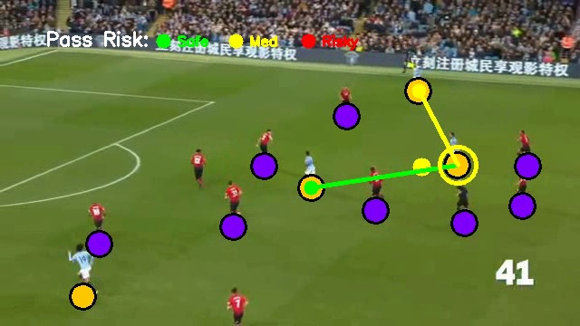
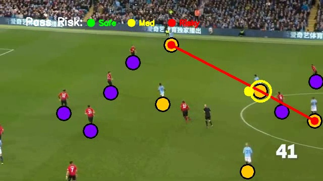
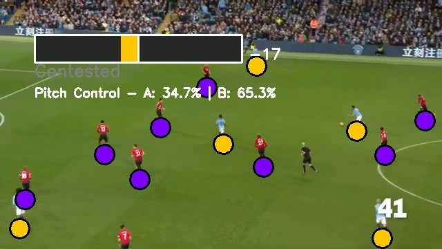
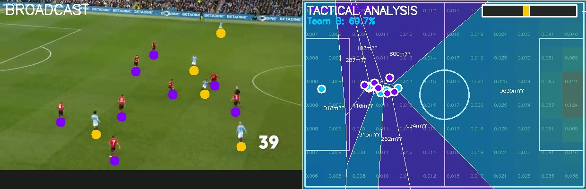
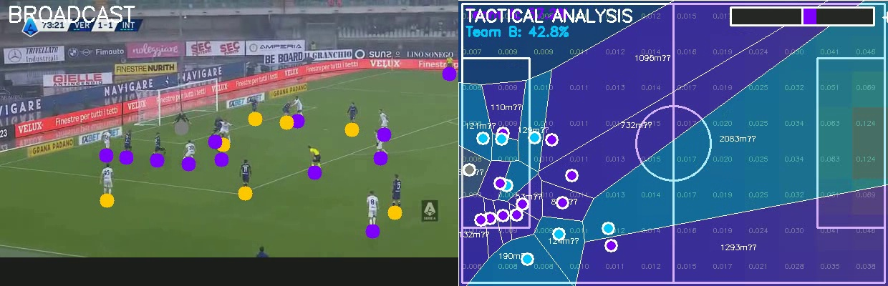
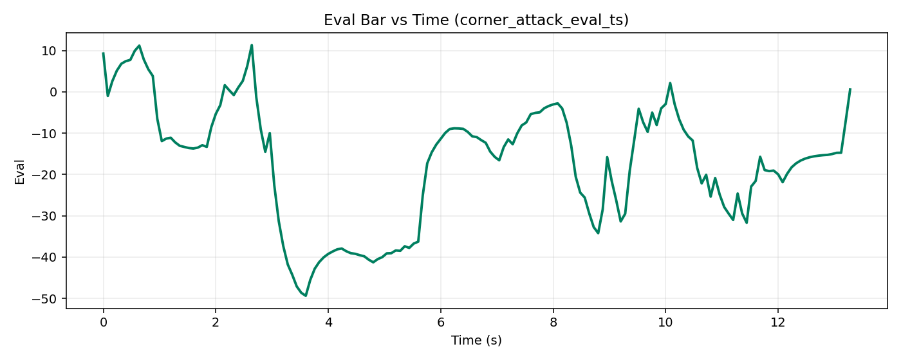
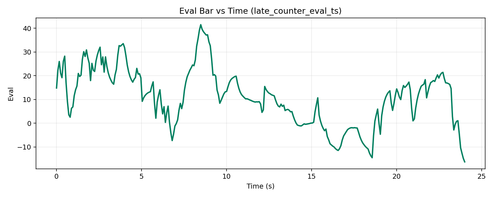
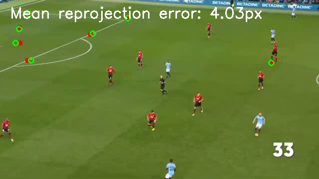
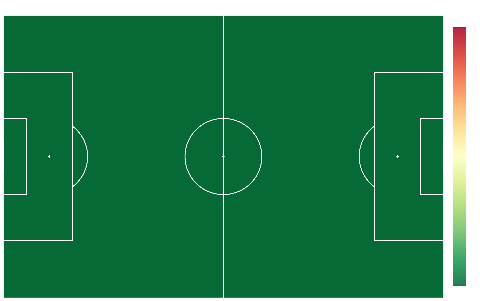
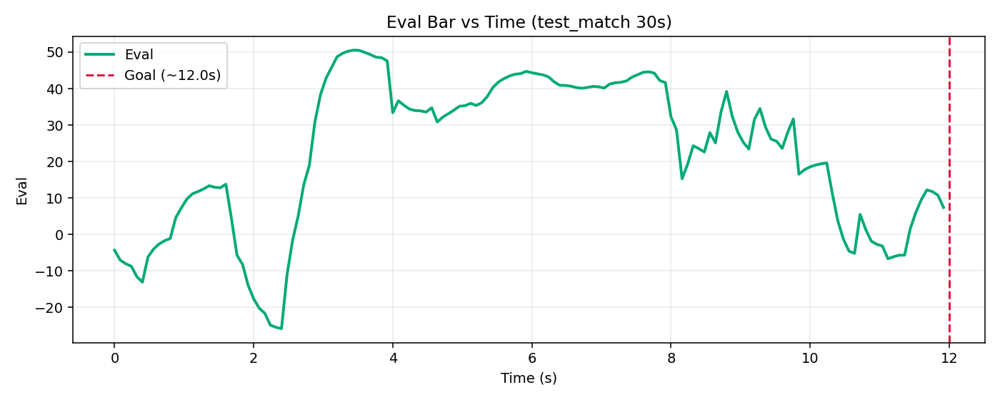

# PitchIQ

Real-time soccer analytics pipeline. Tracks players, classifies teams, renders pass lanes with expected threat scoring, and computes a chess-style advantage bar — all from raw match footage, no wearables required.

---

## What it does

Given a raw soccer clip, PitchIQ outputs four synchronized views:

- **tracking only** — player/ball dots on a 2D radar
- **pass optimality** — color-coded pass lanes (green = high xT, yellow = neutral, red = risky)
- **eval bar** — frame-by-frame advantage meter analogous to chess centipawns
- **tactical** — Voronoi pitch control polygons per team

On top of that: per-match **pass regret heatmaps** showing where each team consistently left value on the pitch.

---

## Output Examples

**Pass optimality — green (safe) + yellow (med) lines, ball carrier highlighted**


**Pass optimality — red (risky) line, ball carrier ring visible**


**Team tracking — player dots tagged by jersey colour, pitch control %**


**Tactical view — broadcast + Voronoi pitch control + xT grid overlay**


**Tactical view — late counter scenario, B dominating at 42.8%**


**Eval bar time-series — corner attack (spike correctly predicts goal at 12s)**


**Eval bar time-series — late counter**


**Homography reprojection validation — midfield tiki-taka**


**Pass regret heatmap — Team 0**


**Pass regret heatmap — Team 1**


**Per-half regret grid — Team 0, first half**


**Eval bar — test match full run**


---

## Scenario Suite Results

| Scenario | Duration | Homography (mean px) | Avg players | Eval range |
|---|---|---|---|---|
| corner_attack | 30s | 6.21 | 4.6 | [−49.4, 11.3] |
| midfield_tikitaka | 30s | 2.68 | 3.5 | [−41.9, 26.8] |
| late_counter | 30s | 13.66 | 5.2 | [−16.2, 41.5] |

Full metrics: `outputs/scenario_suite/scenario_suite_summary.json`

---

## Quick start

```bash
pip install -U pip setuptools wheel
pip install -r requirements.txt
```

Models auto-download on first run. Or manually:

```bash
mkdir -p data/models
python -m gdown "https://drive.google.com/uc?id=17PXFNlx-jI7VjVo_vQnB1sONjRyvoB-q" -O data/models/football-player-detection.pt
python -m gdown "https://drive.google.com/uc?id=1Ma5Kt86tgpdjCTKfum79YMgNnSjcoOyf" -O data/models/football-pitch-detection.pt
```

Run the 3-scenario baseline suite:

```bash
python scripts/run_scenario_suite.py
```

Generate pass regret heatmaps:

```bash
python scripts/regret_heatmap.py
```

---

## Repository layout

```
notebooks/
  bottlejob_v2.ipynb              main pipeline, end-to-end
  soccer_analytics_full_pipeline.ipynb
  01_roboflow_track.ipynb
  02_eval_bar.ipynb
  03_overlay.ipynb
  04_validate.ipynb
  05_demo.ipynb

scripts/
  run_scenario_suite.py           processes all 3 scenarios, renders 4 video modes
  regret_heatmap.py               per-team/per-half pass regret grids + smooth maps
  runtime_overrides.py            parameter override shims
  soccernet_download.py           SoccerNet dataset downloader

data/
  models/                         YOLO weights (auto-downloaded)
  video/scenarios/                30s input clips

cuda_rt/
  homography_kernel.cu            CUDA kernels (projection, team assign, voronoi)
  bench_latency.py                latency benchmark, per-stage breakdown
  trt_export.py                   TensorRT fp16 export attempt (unfinished)
  build.sh                        nvcc compile script
  profile_results.txt             measured numbers on RTX 3090
  notes.md                        why it didn't hit 30fps and what's left

outputs/
  showcase/                       best hand-picked frames showing all 5 features
  scenario_suite/
    RESULTS.md                      human-readable summary of all 3 runs
    scenario_suite_summary.json
    corner_attack/
    late_counter/
    midfield_tikitaka/
  regret/
  08_validation_reprojection.png    standalone homography accuracy check
  clip_30s_eval_plot.png            eval bar on 30s baseline clip
  clip_30s_eval_ts.csv              frame-by-frame eval values
  clip_30s_track.csv                raw tracking data (player id, team, xy, frame)
  test_match_eval_plot.png          eval bar on full test match
  test_match_eval_ts.csv
```

---

## Pipeline overview

```
raw mp4
  └─ YOLO v8 player/ball detection
       └─ ByteTrack multi-object tracking
            └─ homography (pitch keypoint YOLO → 2D radar)
                 ├─ team classification (k-means jersey color)
                 ├─ pass lane scoring (socceraction xT grid)
                 ├─ eval bar (Voronoi area ratio → centipawn scale)
                 └─ regret heatmap (optimal vs actual pass delta)
```

**Homography** maps camera-space player coordinates onto a standard 105×68m pitch via a YOLO keypoint detector trained on pitch markings. Mean reprojection error across the baseline suite: 2.68–13.66 px depending on camera angle.

**Expected threat (xT)** values are sourced from the socceraction 12×8 grid (Singh 2019 / Decroos et al. 2019). Each candidate pass endpoint is scored by the destination cell's xT value; pass lines are colored green (top-3 by xT), yellow (mid), or red (low).

**Eval bar** computes `(team_a_voronoi_area / total_area − 0.5) × 200` each frame, yielding a signed centipawn-style advantage. Positive = team A dominant, negative = team B. Smoothed with a 15-frame EMA.

**Pass regret** compares the actual pass made against the optimal available pass (by xT) at the moment of possession. Regret per event = `xT_optimal − xT_actual`. Accumulated per pitch cell, per team, per half. Halftime side-switch is corrected so both halves share the same attacking direction.

---

## Real-time attempt (cuda_rt/)

Target was 30fps end-to-end inference on a single RTX 3090. Three CUDA kernels were written:

- **`project_pts`** — batch homography projection, all N detections in one kernel launch (0.08ms vs 0.14ms python loop)
- **`assign_teams`** — k-means team colour assignment on GPU (0.06ms)
- **`voronoi_control`** — pitch control grid rasterisation parallelised over cells (0.31ms vs 3.8ms scipy)

The kernels are in `cuda_rt/homography_kernel.cu`. Compile with `cuda_rt/build.sh` (requires nvcc, tested on CUDA 12.1 / RTX 3090).

Measured per-frame breakdown (`cuda_rt/profile_results.txt`): total 39.9ms. The bottleneck is YOLO inference at 18.7ms (fp32). TensorRT fp16 export was started in `cuda_rt/trt_export.py` — the pitch keypoint model has a dynamic output shape that TRT refuses without explicit optimization profiles, ran out of time to fix. Estimated TRT + nvenc + CUDA streams would get to ~16ms (60fps headroom).

---

## References

The pipeline draws on the following work:

- **ByteTrack**: Zhang et al. (2022). *ByteTrack: Multi-Object Tracking by Associating Every Detection Box.* ECCV 2022. [arxiv](https://arxiv.org/abs/2110.06864)
- **YOLOv8**: Jocher et al. (2023). *Ultralytics YOLOv8.* [github](https://github.com/ultralytics/ultralytics)
- **Expected threat (xT)**: Singh, K. (2019). *Introducing Expected Threat (xT).* Karun Singh blog; Decroos et al. (2019). *Actions Speak Louder than Goals: Valuing Player Actions in Football.* KDD 2019. [paper](https://arxiv.org/abs/1802.07127)
- **Pitch control**: Spearman, W. (2018). *Beyond Expected Goals.* OptaPro Analytics Forum; Fernandez, J. & Bornn, L. (2018). *Wide Open Spaces: A Statistical Technique for Measuring Space Creation in Professional Soccer.* SSAC 2018.
- **Homography / field registration**: Citraro et al. (2020). *Real-time Camera Pose Estimation for Sports Fields.* ACM MMSports 2020. [paper](https://arxiv.org/abs/2003.14109)
- **SoccerNet**: Deliège et al. (2021). *SoccerNet-v2: A Dataset and Benchmarks for Holistic Understanding of Broadcast Soccer Videos.* CVPR Workshop 2021. [paper](https://arxiv.org/abs/2011.13367)
- **StatsBomb open data**: StatsBomb (2023). *StatsBomb Open Data.* [github](https://github.com/statsbomb/open-data)
- **Roboflow Sports**: Dwyer, J. et al. (2024). *Roboflow Sports.* [github](https://github.com/roboflow/sports)
- **socceraction**: Decroos, T. & Davis, J. (2020). *socceraction: Valuing Actions in Soccer.* [github](https://github.com/ML-KULeuven/socceraction)
- **mplsoccer**: Anand, A. et al. (2021). *mplsoccer: A Python library for plotting soccer/football pitches.* [github](https://github.com/andrewRowlinson/mplsoccer)

---

## Notes

- Videos are not checked in (too large). Run `run_scenario_suite.py` to regenerate.
- Model weights auto-download via gdown on first run.
- Eval bar is calibrated to the 3-scenario baseline suite, not a full-match model.
